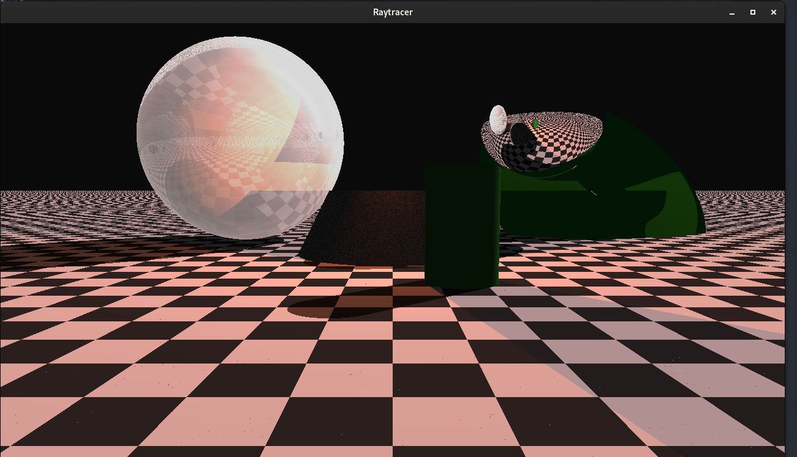
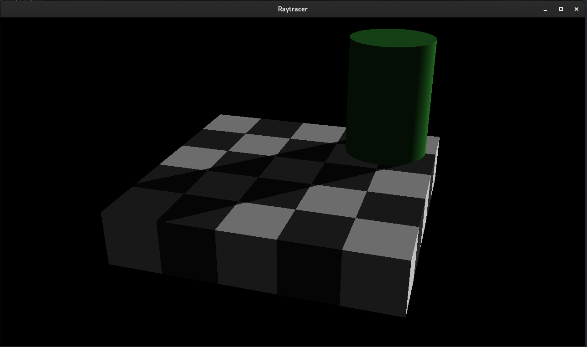
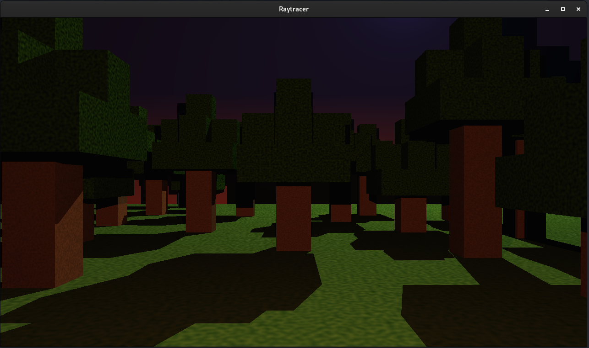
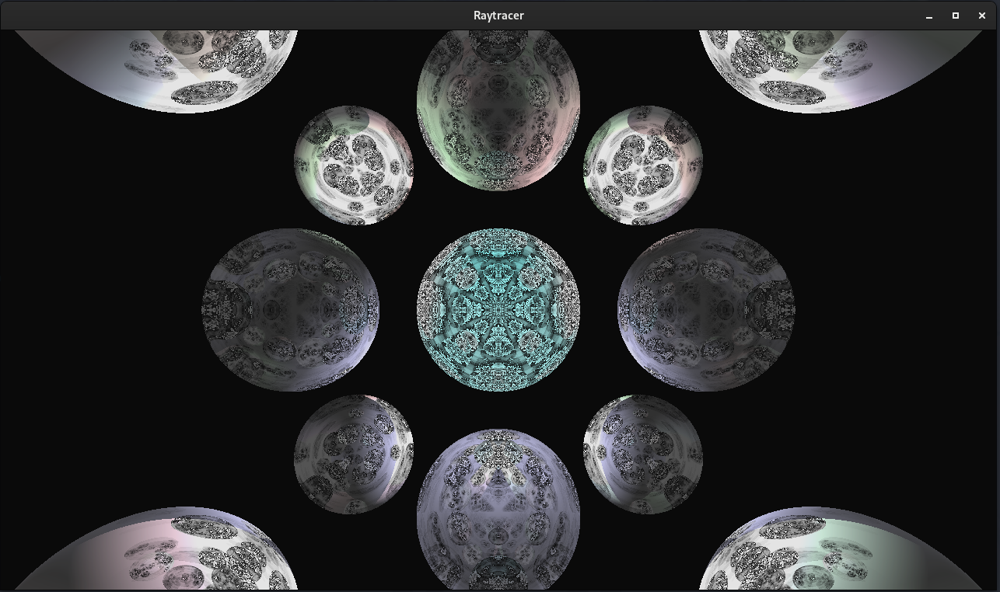

# 🌌 Raytracer

Raytracer is a C++ project developed to render realistic 3D scenes by simulating the physical behavior of light using **ray tracing**.  


## ⚙️ Ray tracing

Ray tracing is a technique for generating photorealistic images by simulating the inverse path of light rays.  
Here’s a simplified explanation of how our engine works:

1. **Ray Casting**: For each pixel in the final image, a virtual "ray" is launched from the camera into the scene.
2. **Intersection Detection**: The ray is tested against all objects (primitives) to find what it hits first.
3. **Shading**: Once a hit is found, the engine computes the color at the impact point based on:
   - Object material (flat color, reflective, transparent…)
   - Lights in the scene (ambient, directional, point lights…)
   - Shadows (if the point is occluded from a light source)
4. **Output**: The result is written pixel by pixel into a `.ppm` image or renderer like `SFML`.

The scene is fully described in an external configuration file (`.cfg`) which is parsed using **libconfig++**.

## 📦 Features

The raytracer is fully **modular** and built around a **plugin system**. Every major component of the rendering pipeline (camera, primitives, lights, materials, renderers) is compiled as a **shared object plugin** (`.so`) and loaded dynamically at runtime.

Plugins are stored in the `./plugins/` directory and are discovered based on their registered type and name. This design allows easy extensibility: adding a new shape or lighting model doesn't require changing the engine core.

### 🔧 Core Principle

Each plugin implements a specific interface:

| Plugin Type | C++ Interface            |
|-------------|--------------------------|
| Camera      | `ICamera`                |
| Primitive   | `IPrimitive`             |
| Light       | `ILight`                 |
| Material    | `IMaterial`              |
| Renderer    | `IRenderer`              |

All geometric computations are performed in **object space**, and transformations (translation, rotation, scaling) are applied using **transform matrices**. Intersection tests are done using **analytical or parametric equations**, then transformed back to world space for lighting and shading.

---

### 🎥 Camera Plugins

The camera plugin is responsible for generating rays per pixel based on image resolution, position, target, up vector, and field of view.

| Plugin        | Description                                                                 |
|---------------|-----------------------------------------------------------------------------|
| `r_c_camera`  | Perspective pinhole camera using look-at vector and FOV. Generates rays in world space per pixel |

**Math**:  
- Converts pixel (x, y) to NDC (Normalized Device Coordinates)  
- Applies aspect ratio and FOV scaling  
- Constructs direction:  
  `dir = forward + right * x + up * y`, normalized

---

### 🧱 Primitive Plugins

Primitives are geometric objects that rays can intersect. Each primitive implements a `hit(ray)` function to compute intersections.

| Plugin                | Description                                                                                   |
|-----------------------|-----------------------------------------------------------------------------------------------|
| `r_p_sphere`          | Sphere with center and radius. Uses quadratic ray-sphere intersection                        |
| `r_p_plane`           | Infinite plane with point and normal. Solves `dot(N, P - P₀) = 0`                             |
| `r_p_cylinder`        | Infinite vertical cylinder (no caps), equation: `x² + z² = r²`                                |
| `r_p_cone`            | Infinite cone from apex using `x² + z² = (k·y)²`, no base                                     |
| `r_p_LimitedCylinder` | Cylinder with finite height and end caps                                                     |
| `r_p_LimitedCone`     | Cone with limited Y extent and optional circular base caps                                   |
| `r_p_Cube`            | Axis-aligned cube via slab intersection. Six planes, slab test per axis                      |
| `r_p_Torus`           | Donut shape, uses quartic equation for ray intersection with 3D torus                        |
| `r_p_triangles`       | Triangle mesh or individual triangle using Möller–Trumbore algorithm                         |


### 🔄 Supported Transformations (All Primitives)

Each primitive supports a set of geometric transformations, applied via `TransformMatrix` before intersection testing:

| Transformation | Description                                             | Math Applied |
|----------------|---------------------------------------------------------|--------------|
| **Translation** | Moves the object in space                              | Added as column in affine matrix |
| **Scaling**     | Changes size (uniform or per axis)                     | Diagonal scaling matrix |
| **Rotation X/Y/Z** | Rotates object around world axes                  | Trigonometric rotation matrices |

---

### 💡 Light Plugins

Lights provide illumination and shadows for shading points hit by rays.

| Plugin              | Description                                                                                 |
|---------------------|---------------------------------------------------------------------------------------------|
| `r_l_ambient`       | Constant color contribution, applied uniformly without direction or occlusion              |
| `r_l_directional`   | Infinite directional light using Lambertian (diffuse) shading with shadow ray test         |
| `r_l_pointLight`    | Point light emitting from a position, with distance attenuation and occlusion              |

**Math (Lambert)**:  
`color = intensity × max(0, dot(N, L))`  
Where `N` is surface normal, `L` is normalized light direction

---

### 🎨 Material Plugins

Materials define how a surface reflects or transmits light. They set visual properties like color, reflectivity, or texture.

| Plugin              | Description                                                                                      |
|---------------------|--------------------------------------------------------------------------------------------------|
| `r_m_flatcolor`     | Constant color material (no lighting interaction)                                                |
| `r_m_Checkboard`    | 3D checker pattern using world position and tile size                                            |
| `r_m_glass`         | Simulates reflection and refraction using Schlick's approximation with index of refraction (IOR) |
| `r_m_gradient`      | Vertical Y-gradient interpolating between two colors                                             |
| `r_m_mirror`        | Fully reflective material (reflectivity = 1.0)                                                   |
| `r_m_perlin`        | Procedural texture using 3D Perlin noise between two colors                                      |
| `r_m_transparent`   | Semi-transparent material with fixed reflectivity and refractive index                          |

**Advanced models**:
- **Schlick’s Approximation** (used in reflective/refractive materials):

  This formula estimates how much light is reflected vs refracted depending on the viewing angle and material properties:

  **R(θ) ≈ R₀ + (1 - R₀) × (1 - cos(θ))⁵**

  Where:
  - **θ** is the angle between the view ray and the surface normal
  - **R₀** is the reflectance at normal incidence, calculated as:

    **R₀ = ((1 - n) / (1 + n))²**

    with **n** being the **index of refraction** (IOR) of the material.

  This model gives a smooth transition between reflection and transparency, making glass or water more realistic.


- **Perlin noise**:  
  Generates natural randomness based on gradients and smooth interpolation in 3D space

---

### 🖼️ Renderer Plugin

Renderers output the computed image. The default output is `.ppm`, but plugins like SFML enable real-time previews.

| Plugin        | Description                                           |
|---------------|-------------------------------------------------------|
| `r_r_sfml`    | Live display of rendering progress using SFML window  |

---

### ➕ Add Your Own Plugin

To create a new plugin (primitive, light, material, etc.), refer to:

**📄 [`docs/technical.md`](./docs/technical.md)**  
This file includes step-by-step instructions for implementing, registering, compiling, and testing a plugin using our plugin architecture.

## 🚀 How to Run

Once compiled, run the raytracer with:

```sh
./raytracer <your_scene.cfg>
```

This will parse the scene, run the rendering engine, and write the output to `output.ppm` (by default).

You can specify a custom output file using `-o`:

```sh
./raytracer scenes/demo_sphere.cfg -o result.ppm
```

---

### 🛠️ Build Instructions


```sh
./build_script.sh
./raytracer scenes/example.cfg
```

Plugins are compiled automatically into the `./plugins/` folder.

---

### 📁 Scene Files

Scene configuration files are written using the `libconfig++` format.

They describe:
- Camera settings
- Primitives and their transforms
- Lighting setup
- Material assignments

See full documentation:

**📄 [`docs/CFG.md`](./docs/CFG.md)**

## 🖼️ Examples & Output

Here are some rendered scenes generated using this raytracer. Each one showcases a different feature of the engine (lighting, geometry, materials, and plugins).

---

### 🔵 Classic Scene

A standard test scene with spheres, plane, ambient and directional lights.

**Scene file**: `scenes/scene.cfg`  
**Output**:  


---

### 🌀 Optical Illusion

Complex shape and material arrangement creating visual tricks (reflective + refractive mix).

**Scene file**: `scenes/optical.cfg`  
**Output**:  


---

### 🟫 Minecraft Style Blocks

Voxel-like structure made from cubes with checkerboard and gradient textures.

**Scene file**: `scenes/Mincraft.cfg`  
**Output**:  


---

### 🧬 Fractal Render (Bonus)

A procedural fractal shape rendered via recursive SDF-based plugin.

**Scene file**: `scenes/mirrorroom.cfg`  
**Output**:  



